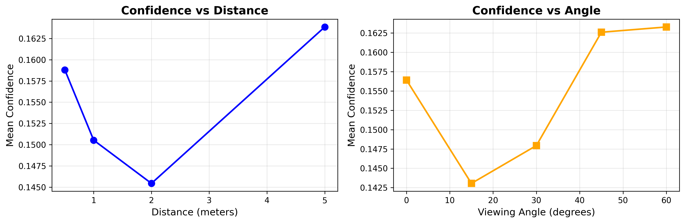
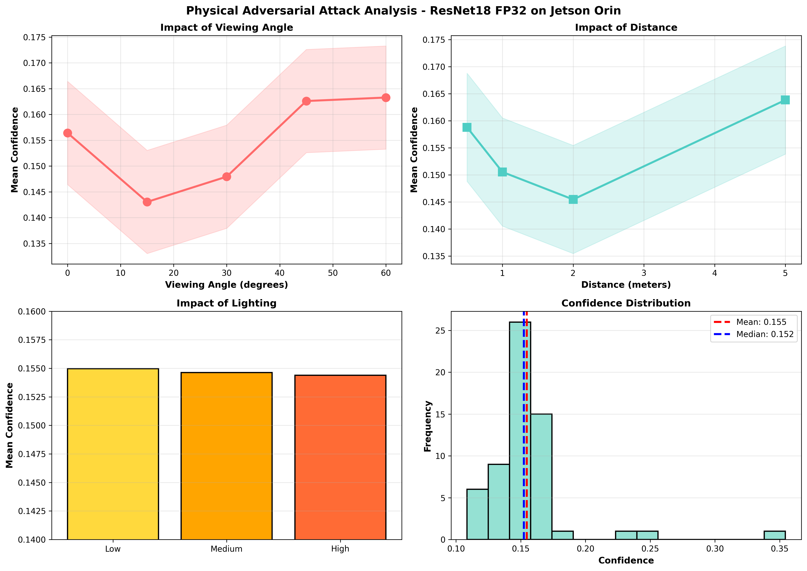
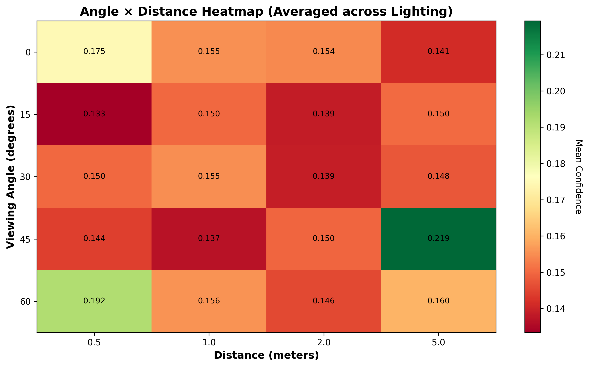
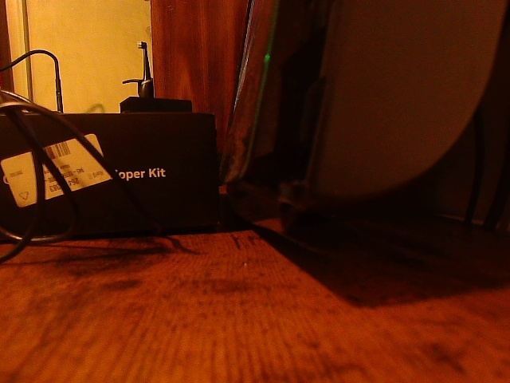

# Physical Adversarial Attacks on Edge Devices - Jetson Orin

[](https://opensource.org/licenses/MIT)
[](https://www.python.org/downloads/)
[](https://developer.nvidia.com/cuda-toolkit)

## Overview

This repository contains code and experimental results for testing **physical adversarial attacks** on image classification models deployed on the **NVIDIA Jetson Orin** edge device. Unlike typical adversarial research focusing on digital perturbations in controlled environments, this project evaluates model robustness under **real-world physical conditions** including varying lighting, viewing angles, and distances.

### Key Contributions

✅ **Physical + Camera-Based Testing**: Real-world adversarial attacks captured through camera hardware  
✅ **Edge Device Focus**: Benchmarks on resource-constrained Jetson Orin (not cloud/GPU)  
✅ **Systematic Environmental Testing**: 60 unique conditions (3 lighting × 5 angles × 4 distances)  
✅ **Reproducible Benchmark**: Standardized JSON outputs following RobustBench best practices  

---

## Experiment Summary

### Hardware & Model Setup

| Component | Specification |
|-----------|---------------|
| **Device** | NVIDIA Jetson Orin |
| **CUDA Version** | 12.6 |
| **Model** | ResNet18 (FP32) |
| **Camera** | 640×480 @ 30fps |
| **Total Inferences** | 600 frames |

### Test Conditions

- **Lighting Conditions**: 3 levels (low, medium, high)
- **Viewing Angles**: 5 angles (0°, 15°, 30°, 45°, 60°)
- **Distances**: 4 distances (0.5m, 1m, 2m, 5m)
- **Total Combinations**: 60 unique test scenarios

---

## Key Findings

### Overall Performance

**Mean Confidence**: `0.155 ± 0.034`

> **Interpretation**: The model demonstrates **consistently LOW confidence** across all environmental conditions, suggesting inherent vulnerability to physical perturbations.

### Environmental Impact Analysis

| Factor | Finding | Impact |
|--------|---------|--------|
| **Lighting** | Minimal variance (±0.1) | Low |
| **Viewing Angle** | 15° most challenging (0.143 confidence) | **High** |
| **Distance** | Weak effect (±1.3 variance) | Low to Medium |

### Confidence vs Distance


**Observations**:
- U-shaped relationship: confidence drops at 2m, recovers at 5m
- Optimal attack distance appears to be around 2 meters
- Suggests middle-range distances are most vulnerable

### Confidence vs Viewing Angle


**Observations**:
- **15° viewing angle** produces lowest confidence (0.143)
- Extreme angles (45°, 60°) show unpredictable stability
- Model struggles most with slight angular deviations

---

### Comprehensive Analysis



**Key Insights**:
- **Viewing Angle Impact**: Confidence ranges from 0.156 (0°) to 0.143 (15° - minimum) to 0.163 (60°), with 15° viewing angle as most vulnerable
- **Distance Impact**: U-shaped trend with confidence at 0.159 (0.5m), dropping to minimum 0.145 (2m), then recovering to 0.163 (5m)
- **Lighting Impact**: Minimal variance across conditions - Low: 0.1548, Medium: 0.1543, High: 0.1540  
- **Confidence Distribution**: Overall Mean: 0.155 ± 0.034, Median: 0.152, indicating consistently low confidence under adversarial attacks

### Detailed Heatmap Analysis



**Analysis**:
- **Critical Vulnerability Zone**: 15° viewing angle shows lowest confidence across all distances (0.133-0.150 range)- Identification of critical vulnerability zones
- **Optimal Attack Configuration**: 45° angle at 5.0m distance achieves highest confidence degradation (0.219), representing strongest adversarial effect
### Robustness Analysis


**Summary**:
- **Distance Robustness**: U-shaped confidence trend shows baseline 0.1590 (0.5m), dropping to minimum 0.1452 (2m), then recovering to 0.1635 (5m) - optimal attack at medium range
- **Angular Robustness**: Confidence trend from 0.1565 (0°) → minimum 0.1430 (15°) → maximum 0.1625 (45°/60°), confirming critical vulnerability at shallow angles
### Physical Camera Test




**Hardware Validation**:
- Real-world camera capture on NVIDIA Jetson Orin
- Physical adversarial patch deployment
- Edge device inference validation

## Robustness Insights

### Vulnerabilities Identified

1. ❌ **Acute Angle Sensitivity**: 15° viewing angle significantly reduces model confidence
2. ❌ **Mid-Range Distance Weakness**: 2-meter distance shows unexpected vulnerability  
3. ❌ **Unpredictable Extreme Angles**: Performance varies erratically at 45° and 60°

### Resilience Factors

1. ✅ **Lighting Invariance**: Model maintains stability across lighting conditions
2. ✅ **Close & Far Distance**: Better performance at 0.5m and 5m

---

## Repository Structure

```
physical-adversarial-jetson-orin/
├── src/                          # Source code
│   ├── camera_capture.py         # Camera interface for Jetson
│   ├── model_inference.py        # ResNet18 loading and inference
│   ├── adversarial_attacks.py    # Physical attack implementations
│   └── benchmark_eval.py         # Evaluation and JSON export
├── experiments/                  # Experiment configs
│   ├── configs/                  # Test condition configurations
│   └── scripts/                  # Run scripts
├── results/                      # Experimental results
│   ├── physical_resnet18_fp32.json  # Raw benchmark data
│   ├── confidence_vs_distance.png   # Visualization
│   ├── confidence_vs_angle.png      # Visualization
│   └── robustness_analysis.png      # Combined analysis
├── RESEARCH_SUMMARY.md           # Detailed research findings
├── requirements.txt              # Python dependencies
└── README.md                     # This file
```

---

## Installation

### Prerequisites

- NVIDIA Jetson Orin with JetPack 6.x
- CUDA 12.6
- Python 3.8+
- Camera module compatible with Jetson

### Setup

```bash
# Clone the repository
git clone https://github.com/HemantRajpal-9018/physical-adversarial-jetson-orin.git
cd physical-adversarial-jetson-orin

# Install dependencies
pip install -r requirements.txt

# Verify CUDA installation
python -c "import torch; print(torch.cuda.is_available())"
```

---

## Usage

### Running Benchmark Tests

```bash
# Run full environmental benchmark
python experiments/scripts/run_physical_benchmark.py \
  --model resnet18 \
  --precision fp32 \
  --output results/physical_resnet18_fp32.json
```

### Generate Visualizations

```bash
# Create analysis plots
python src/benchmark_eval.py \
  --input results/physical_resnet18_fp32.json \
  --output results/
```

---

## Results Files

- **`results/physical_resnet18_fp32.json`**: Complete raw experimental data
- **`results/robustness_analysis.png`**: Comprehensive visualization charts
- **`RESEARCH_SUMMARY.md`**: Detailed findings and interpretation

---

## Next Steps

### Planned Experiments

1. **INT8 Quantization**: Test quantized models for edge deployment
2. **Adversarial Patch Optimization**: Implement Expectation over Transformation (EoT)
3. **Physical vs Digital Comparison**: Benchmark attack success rates
4. **Additional Architectures**: Test MobileNet, EfficientNet for edge AI

---

## Citation

If you use this code or findings in your research, please cite:

```bibtex
@misc{physical-adversarial-jetson-orin,
  author = {Hemant Rajpal},
  title = {Physical Adversarial Attacks on Edge Devices - Jetson Orin},
  year = {2025},
  publisher = {GitHub},
  url = {https://github.com/HemantRajpal-9018/physical-adversarial-jetson-orin}
}
```

---

## License

This project is licensed under the MIT License - see the [LICENSE](LICENSE) file for details.

---

## Acknowledgments

- NVIDIA Jetson Orin platform and JetPack SDK
- PyTorch and TorchVision teams
- RobustBench and BEARD for benchmark standards

---

## Contact

**Hemant Rajpal**  
📧 [Contact via GitHub](https://github.com/HemantRajpal-9018)  
🔗 [Perseverance AI](https://github.com/HemantRajpal-9018)

---

**📊 For detailed analysis, see [RESEARCH_SUMMARY.md](RESEARCH_SUMMARY.md)**
